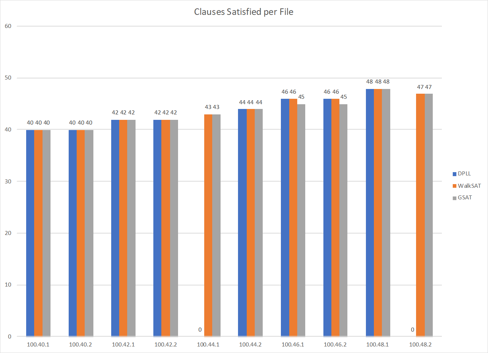
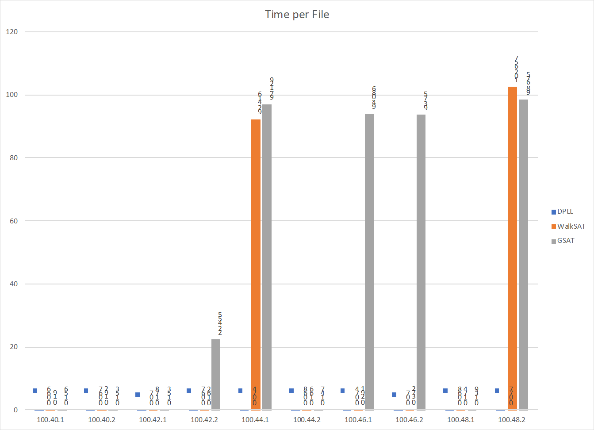

# 3SAT Algorithms

## What is 3SAT and this Project?

3SAT is shorthand for a *Boolean Satisfiability Problem*.

Detail about these types of problems can be found [here](https://en.wikipedia.org/wiki/Boolean_satisfiability_problem), but in short they are Boolean Expressions containing 3 variables. The soulutions to these expressions are any assignments of `True` or `False` to these variables that make the statement true. Not every expression has a solution and determining if one exists is the true difficulty of this exercise.

This project contains three different algorithms to solve this problem and compares their results. The input and output expected of these programs can be found [here](http://www.satcompetition.org/2004/format-solvers2004.html).

# In this folder
| File | Description |
|:---| :--- |
DPLL.py|Implementation of DPLL algorithm
walkSat.py|Implementation of WalkSAT algorithm
gSat.py | Implementation of GSAT algorithm
D_10.log |	results of running DPLL on cnf files in fixedDimacs.zip
W_10.log |	results of running WalkSAT on cnf files in fixedDimacs.zip
G_10.log |	results of running GSAT on cnf files in fixedDimacs.zip
DPLL.log |	results of running DPLL on select files from 3cnf_100atoms_new.tar
WSAT.log |	results of running WalkSAT on select files from 3cnf_100atoms_new.tar
GSAT.log |	results of running GSAT on select files from 3cnf_100atoms_new.tar
graph10_c.png |	fixedDimacs solved clauses graphed
graph10_t.png |	fixedDimacs times graphed
fixedDimacs.zip | test files
3cnf_100atoms_new.tar | more test files

# Algorithm implementation notes

## DPLL
[Description](https://en.wikipedia.org/wiki/DPLL_algorithm)

- implemented in python
- no important design decisions to note
- run with python3 DPLL.py <FILE/DIRNAME>

## WalkSAT
[Description](https://en.wikipedia.org/wiki/WalkSAT)

- implemented in python
- 30% chance to select random variable from bad clause
- 10000 Flips before jumping
- 3 jumps before returning UNKNOWN
- run with python3 walkSat.py <FILE/DIRNAME>

## GSAT
[Description](https://en.wikipedia.org/wiki/WalkSAT)

- implemented in python
- 1000 Flips before jumping
- 3 jumps before returning UNKNOWN
- run with python3 gSat.py <FILE/DIRNAME>

# Conclusions:
For small problems, DPLL is the fastest hands down and will find an incorrect solution in a very fast manner as well

While WalkSAT and GSAT take signifigant orders of magnitude longer to find an incorrect solution

For larger problems, as a whole, DPLL is most efficient as it has a consistant time to completion.

However, the introduction of Randomness in WalkSAT and GSAT means that they do occasionally find a solution much faster.

Walksat tends to outclass GSAT as it has the capability to jump out of plateaus and local minimum with it's chance to select a random element in a bad clause

GSAT as a whole takes a tremendous amount of time, as greedy algorithms tend to do

# Graphs

Graph10_c.png:

Graph10_t.png:

